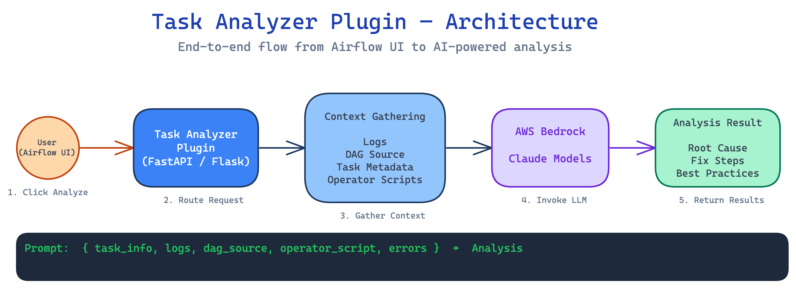
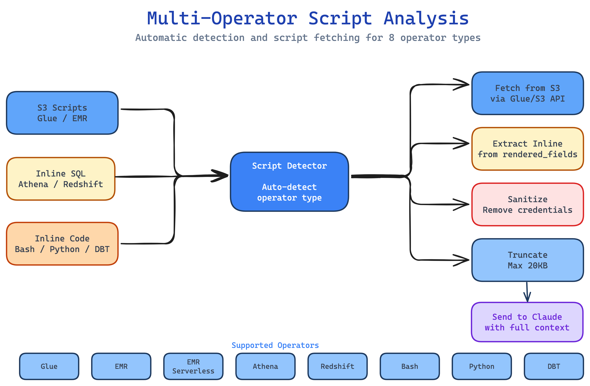
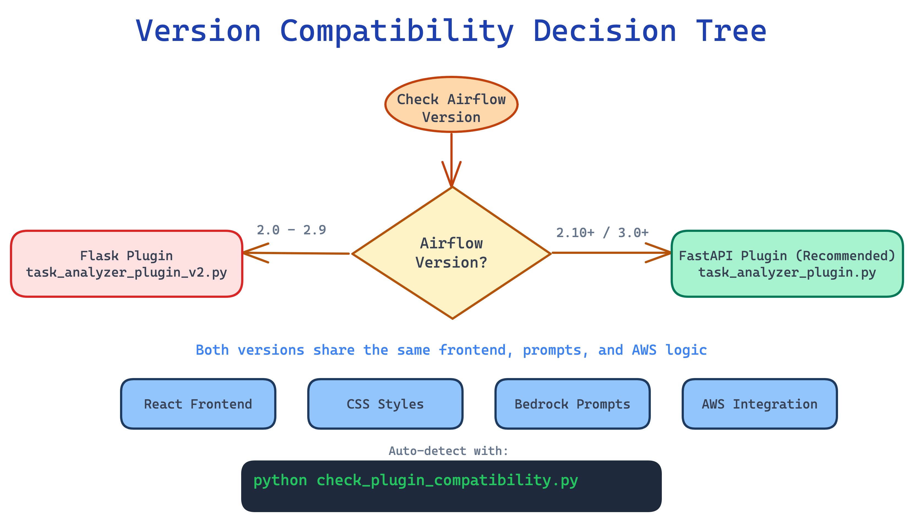
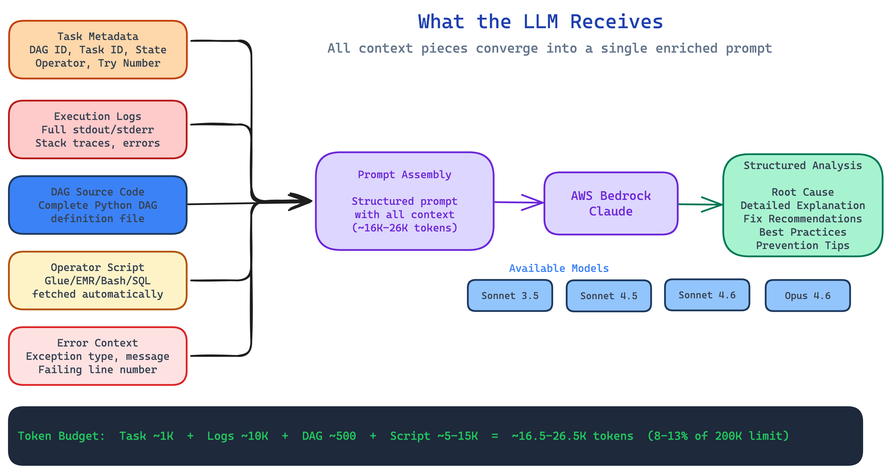

# Task Analyzer Plugin

AI-powered Airflow task failure analyzer with support for Airflow 2.0+ and 3.x.

## Table of Contents
- [Quick Start](#quick-start)
- [Features](#features)
- [Version Compatibility](#version-compatibility)
- [Installation](#installation)
- [Migration Guide](#migration-guide)
- [Technical Details](#technical-details)
- [Troubleshooting](#troubleshooting)
- [Requirements](#requirements)

---

## Quick Start

### 1. Check Your Airflow Version
```bash
python check_plugin_compatibility.py
```
*Automatically detects: Astro CLI, MWAA Local, or standard Airflow*

### 2. Choose Plugin Version

| Airflow Version | Plugin File | Framework |
|----------------|-------------|-----------|
| 2.0 - 2.9.x | `task_analyzer_plugin_v2.py` | Flask |
| 2.10+ | `task_analyzer_plugin.py` | FastAPI |
| 3.0+ | `task_analyzer_plugin.py` | FastAPI |

### 3. Switch if Needed (Airflow 2.0-2.9 only)
```bash
mv plugins/task_analyzer_plugin.py plugins/task_analyzer_plugin_v3.backup
cp plugins/task_analyzer_plugin_v2.py plugins/task_analyzer_plugin.py

# Restart based on your environment
astro dev restart              # Astro CLI
docker-compose restart         # MWAA Local
systemctl restart airflow      # Standard Airflow
```

### 4. Verify
Open: http://localhost:8080/task-analyzer/

---

## Architecture



## Features

- 🤖 AI-powered task failure analysis using AWS Bedrock
- 🔍 Root cause identification with detailed explanations
- 💡 Actionable fix recommendations
- 📊 Multiple Claude model support (Sonnet 3.5, 4.5, 4.6, Opus 4.6)
- 🔄 Works with Airflow 2.0+ and 3.x
- 🐳 Compatible with Astro CLI and MWAA Local
- ⚡ FastAPI support for Airflow 2.10+
- 📝 Comprehensive DAG context analysis
- 🔗 Direct integration with Airflow UI
- 🗺️ **Full support for dynamically mapped tasks**
- ⚙️ **Multi-operator script analysis** - Automatically fetches and analyzes scripts from:
  - AWS Glue jobs (from S3)
  - EMR steps (from S3)
  - Athena queries (inline SQL)
  - Redshift queries (inline SQL)
  - Bash commands (inline)
  - Python callables (function names)
  - DBT models (model names)

---

## Supported Operators



The plugin automatically detects and analyzes scripts from various operators:

| Operator | Script Source | What's Analyzed | Button Label |
|----------|--------------|-----------------|--------------|
| **GlueJobOperator** | S3 (fetched via Glue API) | Full Python/Scala script | Show AWS Glue Job |
| **EmrAddStepsOperator** | S3 (from step args) | Full PySpark/Spark script | Show EMR Step |
| **EmrServerlessStartJobOperator** | S3 (from job config) | Full application script | Show EMR Serverless Job |
| **AthenaOperator** | Inline (from query param) | Complete SQL query | Show Athena Query |
| **RedshiftDataOperator** | Inline (from sql param) | Complete SQL query | Show Redshift Query |
| **BashOperator** | Inline (from bash_command) | Full bash command | Show Bash Script |
| **PythonOperator** | Inline (function name only) | Callable name + DAG code | Show Python Code |
| **DbtRunOperator** | Inline (from models/select) | Model names | Show DBT Models |

### How It Works

**1. Automatic Detection**
- Plugin reads task context from Airflow API
- Identifies operator type from task metadata
- Determines if script analysis would be valuable

**2. Script Fetching**

**External Scripts (Glue, EMR):**
```python
# Fetches from AWS
glue_client.get_job(JobName='MyJob')  # Get S3 location
s3_client.get_object(Bucket=bucket, Key=key)  # Download script
```

**Inline Scripts (Bash, SQL):**
```python
# Extracted from rendered_fields
bash_command = context['rendered_fields']['bash_command']
sql_query = context['rendered_fields']['query']
```

**3. Smart Processing**
- Sanitizes credentials (passwords, tokens, keys)
- Truncates large scripts (max 20KB)
- For join/broadcast errors: extracts relevant code sections
- Adds operator-specific context to LLM prompt

**4. Enhanced Analysis**

The LLM receives:
```
- Task information (DAG, task ID, state)
- Full execution logs
- DAG source code
- Operator-specific script (with type context)
- Error messages and stack traces
```

**Example for Bash:**
```
## Bash Script
**Operator Type**: Bash Script
**Script Location**: inline_bash_command
**Script Size**: 0.01 KB

```
exit 1
```

**Analysis Context**: This is a Bash Script. Consider operator-specific 
best practices, common pitfalls, and error patterns when analyzing the failure.
```

### Script Analysis Benefits

**For Code Errors (Syntax, Logic):**
- ⭐⭐⭐⭐⭐ Glue/EMR scripts - See exact error line
- ⭐⭐⭐⭐⭐ SQL queries - Identify syntax/logic issues
- ⭐⭐⭐⭐⭐ Bash commands - Understand command failures

**For Join/Broadcast Failures:**
- ⭐⭐⭐⭐⭐ Glue/EMR - See join conditions, data types
- ⭐⭐⭐⭐⭐ Athena/Redshift - Analyze SQL joins

**For Infrastructure Issues:**
- ⭐⭐ Less valuable (script won't help with memory/timeout)

### Configuration

**Required AWS Permissions:**

For Glue script fetching:
```json
{
  "Effect": "Allow",
  "Action": ["glue:GetJob"],
  "Resource": "arn:aws:glue:*:*:job/*"
}
```

For S3 script fetching:
```json
{
  "Effect": "Allow",
  "Action": ["s3:GetObject"],
  "Resource": "arn:aws:s3:::your-scripts-bucket/*"
}
```

**No configuration needed** - Works automatically for all supported operators!

---

## Version Compatibility



### FastAPI Version (Recommended)
**File**: `task_analyzer_plugin.py`

- **Airflow Version**: 2.10+ and 3.x
- **Environments**: Astro Runtime 3.x, MWAA 2.10+/3.x, Airflow 2.10+/3.x
- **Technology**: FastAPI
- **Usage**: Default - no changes needed

### Flask Version (Legacy)
**File**: `task_analyzer_plugin_v2.py`

- **Airflow Version**: 2.0 - 2.9.x only
- **Environments**: Astro Runtime 2.x, MWAA 2.0-2.9, Airflow 2.0-2.9
- **Technology**: Flask Blueprint
- **Usage**: Rename to `task_analyzer_plugin.py`

### How to Choose

Run the universal version checker:
```bash
python check_plugin_compatibility.py
```

The script automatically detects your environment and recommends the correct plugin.

---

## Installation

### Prerequisites
- Apache Airflow 2.0+ or 3.0+
- AWS credentials with Bedrock access
- `aws_default` connection configured in Airflow
- FastAPI (for Airflow 2.10+/3.x): `pip install fastapi`

### Setup Steps

1. **Place plugin files in your Airflow plugins directory**
   ```bash
   # Files should be in: <airflow_home>/plugins/
   task_analyzer_plugin.py
   task_analyzer_plugin_v2.py
   task_analyzer/
   ```

2. **Configure AWS connection**
   - Create `aws_default` connection in Airflow UI
   - Add AWS credentials with Bedrock access
   - Set region (e.g., us-east-1)

3. **(Optional) Configure Bedrock Models**
   
   The plugin supports the following Claude models with configurable model IDs via Airflow Variables.
   
   **Default Model IDs (US Region):**
   
   If no variables are set, these defaults are used:
   
   | Model | Default Model ID | Variable Name |
   |-------|-----------------|---------------|
   | Claude Sonnet 4.6 | `us.anthropic.claude-sonnet-4-6` | `bedrock_sonnet_4_6_model_id` |
   | Claude Opus 4.6 | `us.anthropic.claude-opus-4-6-v1` | `bedrock_opus_4_6_model_id` |
   | Claude Sonnet 4.5 | `us.anthropic.claude-sonnet-4-5-20250929-v1:0` | `bedrock_sonnet_4_5_model_id` |
   | Claude Sonnet 3.5 | `us.anthropic.claude-3-5-sonnet-20241022-v2:0` | `bedrock_sonnet_3_5_model_id` |
   | Default Model | `claude-3.5-sonnet` | `bedrock_default_model` |
   
   **How to Override for Different Regions:**
   
   **Option 1: Via Airflow UI** (Admin → Variables)
   
   Add variables to override specific models:
   ```
   Key: bedrock_sonnet_4_6_model_id
   Value: eu.anthropic.claude-sonnet-4-6
   
   Key: bedrock_default_model
   Value: claude-sonnet-4.5
   ```
   
   **Option 2: Via airflow_settings.yaml** (local development)
   ```yaml
   airflow:
     variables:
       - variable_name: bedrock_sonnet_4_6_model_id
         variable_value: eu.anthropic.claude-sonnet-4-6
       - variable_name: bedrock_opus_4_6_model_id
         variable_value: eu.anthropic.claude-opus-4-6-v1
       - variable_name: bedrock_default_model
         variable_value: claude-sonnet-4.6
   ```
   
   **Region-Specific Examples:**
   
   **EU Region:**
   ```
   bedrock_sonnet_4_6_model_id = eu.anthropic.claude-sonnet-4-6
   bedrock_opus_4_6_model_id = eu.anthropic.claude-opus-4-6-v1
   bedrock_sonnet_4_5_model_id = eu.anthropic.claude-sonnet-4-5-20250929-v1:0
   bedrock_sonnet_3_5_model_id = eu.anthropic.claude-3-5-sonnet-20241022-v2:0
   ```
   
   **Global Inference Profiles:**
   ```
   bedrock_sonnet_4_6_model_id = global.anthropic.claude-sonnet-4-6
   bedrock_opus_4_6_model_id = global.anthropic.claude-opus-4-6-v1
   ```
   
   **AP Region:**
   ```
   bedrock_sonnet_4_6_model_id = ap.anthropic.claude-sonnet-4-6
   ```
   
   **Note**: Only set variables for models you want to override. Unset variables will use the US region defaults.

4. **Restart Airflow**
   ```bash
   astro dev restart              # Astro CLI
   docker-compose restart         # MWAA Local
   systemctl restart airflow      # Standard Airflow
   ```

5. **Verify installation**
   - Check Airflow UI for "Analyze Task" menu item
   - Navigate to http://localhost:8080/task-analyzer/
   - View logs for any errors

---

## Migration Guide

### From Airflow 3.x to 2.0-2.9

```bash
# 1. Backup and switch
mv plugins/task_analyzer_plugin.py plugins/task_analyzer_plugin_v3.backup
cp plugins/task_analyzer_plugin_v2.py plugins/task_analyzer_plugin.py

# 2. Restart
astro dev restart              # Astro CLI
docker-compose restart         # MWAA Local
systemctl restart airflow      # Standard Airflow

# 3. Verify: http://localhost:8080/task-analyzer/
```

### From Airflow 2.0-2.9 to 2.10+/3.x

```bash
# 1. Restore FastAPI version
mv plugins/task_analyzer_plugin_v3.backup plugins/task_analyzer_plugin.py

# 2. Install FastAPI if needed
pip install fastapi

# 3. Restart
astro dev restart              # Astro CLI
docker-compose restart         # MWAA Local
systemctl restart airflow      # Standard Airflow
```

### Testing Checklist

After migration, verify:
- [ ] Plugin loads without errors
- [ ] Menu item appears in Airflow UI
- [ ] `/task-analyzer/` URL accessible
- [ ] Task information displays correctly
- [ ] LLM analysis works
- [ ] Model selection functions
- [ ] AWS connection succeeds

---

## Technical Details

### Mapped Task Support

The plugin **automatically detects and handles both mapped and non-mapped tasks** without any configuration.

#### How It Works

**1. Task Detection**
- Extracts task information from Airflow UI URL path
- Detects mapped tasks by looking for `/mapped/{index}/` in URL
- Fetches task instance data from Airflow API
- Uses `map_index` field from API response

**2. Dynamic URL Construction**

**Non-Mapped Tasks:**
```
Task Context: /api/v2/dags/{dagId}/dagRuns/{runId}/taskInstances/{taskId}
Logs:         /api/v2/dags/{dagId}/dagRuns/{runId}/taskInstances/{taskId}/logs/{tryNumber}
```

**Mapped Tasks:**
```
Task Context: /api/v2/dags/{dagId}/dagRuns/{runId}/taskInstances/{taskId}/{mapIndex}
Logs:         /api/v2/dags/{dagId}/dagRuns/{runId}/taskInstances/{taskId}/logs/{tryNumber}?map_index={mapIndex}
```

**3. Key Features**
- ✅ No hardcoded DAG names, task IDs, or map indices
- ✅ Works with ANY DAG and ANY task
- ✅ Automatic detection from URL and API response
- ✅ Handles task retries using actual `try_number` from context
- ✅ Validates `map_index >= 0` before adding to URLs

**4. Example Usage**

```python
# DAG with dynamic task mapping
@dag()
def my_dag():
    @task
    def process_number(num):
        if num == 2:
            raise ValueError("Intentional failure")
        return num * 2
    
    # Creates mapped tasks: process_number[0], process_number[1], process_number[2]...
    process_number.expand(num=[0, 1, 2, 3, 4, 5])
```

When `process_number[2]` fails:
- Plugin detects `map_index=2` from URL or API
- Fetches logs: `/taskInstances/process_number/logs/1?map_index=2`
- Displays context for that specific mapped instance
- LLM analyzes the specific failure with full context

**5. Configuration**

All API endpoints are configured in `config.js`:
```javascript
CONFIG.API.ENDPOINTS = {
    TASK_INSTANCE: '/dags/{dagId}/dagRuns/{runId}/taskInstances/{taskId}',
    LOGS: '/dags/{dagId}/dagRuns/{runId}/taskInstances/{taskId}/logs/{tryNumber}',
    DAG_SOURCE: '/dagSources/{dagId}'
}
```

The plugin dynamically modifies these URLs based on whether the task is mapped or not.

### Multi-Operator Script Integration

The plugin **automatically fetches and analyzes scripts from multiple operator types**. See [Supported Operators](#supported-operators) section above for the complete list.

#### Smart Detection

**When Scripts ARE Fetched:**
- ✅ Always for inline scripts (Bash, SQL, Python)
- ✅ For external scripts (Glue, EMR) when error suggests code issue:
  - Syntax errors, type errors, value errors
  - Join failures, broadcast failures
  - Import errors, key errors

**When Scripts are NOT Fetched:**
- ❌ Infrastructure failures (out of memory, timeout)
- ❌ Permission errors (IAM issues)  
- ❌ Resource constraints (DPU limits, network issues)

#### Script Processing

**1. Automatic Detection**
```python
# Works with any supported operator - no changes needed!
run_glue_job = GlueJobOperator(task_id="glue", job_name="MyJob")
run_query = AthenaOperator(task_id="athena", query="SELECT * FROM table")
run_bash = BashOperator(task_id="bash", bash_command="exit 1")
```

**2. Intelligent Fetching**
- **External scripts**: Fetches from S3 via AWS APIs
- **Inline scripts**: Extracts from task's rendered_fields
- Sanitizes credentials automatically
- Truncates to fit token limits (20KB max)

**3. Operator-Specific Context**

The LLM knows what type of script it's analyzing:
```
## Bash Script
**Operator Type**: Bash Script
**Analysis Context**: This is a Bash Script. Consider operator-specific 
best practices, common pitfalls, and error patterns.
```

**4. Enhanced Analysis**

LLM receives complete context:
- DAG source code
- Task execution logs  
- Task metadata
- **Operator-specific script with type information**
- Script location (S3 path or "inline")

#### Token Usage



**Typical Case:**
- DAG code: ~500 tokens
- Task context: ~1,000 tokens
- Airflow logs: ~10,000 tokens
- Operator script: ~5,000-15,000 tokens
- **Total: ~16,500-26,500 tokens (8-13% of 200K limit)**

**Worst Case:**
- All components at max size
- **Total: ~74,200 tokens (37% of 200K limit)**

**Risk of hitting limit:** <1%

### What Changed Between Versions

| Component | Airflow 2.0-2.9 (Flask) | Airflow 2.10+/3.x (FastAPI) |
|-----------|------------------------|----------------------------|
| **Framework** | Flask Blueprint | FastAPI |
| **Plugin Attribute** | `flask_blueprints` | `fastapi_apps` |
| **Routes** | `@bp.route("/path", methods=["GET"])` | `@app.get("/path")` |
| **Responses** | `jsonify({...})` | `JSONResponse({...})` |
| **File Serving** | `send_from_directory()` | `FileResponse()` |
| **Request Body** | `request.get_json()` | `async def func(request: dict)` |
| **View Integration** | `appbuilder_views` | `external_views` |

### Shared Components (No Changes)

- ✅ All frontend JavaScript/React code
- ✅ CSS styles
- ✅ HTML templates
- ✅ Bedrock prompts configuration
- ✅ AWS integration logic
- ✅ API endpoint URLs
- ✅ Business logic

### File Structure

```
astro/
├── check_plugin_compatibility.py     # Universal version checker (root level)
├── Dockerfile
├── README.md
├── requirements.txt
├── dags/
├── plugins/
│   ├── README.md                     # This file
│   ├── task_analyzer_plugin.py       # Airflow 2.10+/3.x (FastAPI)
│   ├── task_analyzer_plugin_v2.py    # Airflow 2.0-2.9 (Flask)
│   └── task_analyzer/                # Shared resources
│       ├── prompts.py                # Bedrock configuration
│       ├── glue_utils.py             # AWS Glue integration utilities
│       ├── static/                   # Frontend assets
│       │   ├── css/styles.css
│       │   └── js/
│       │       ├── app.jsx
│       │       ├── components.jsx
│       │       ├── config.js
│       │       ├── template.jsx
│       │       └── utils.jsx
│       └── templates/
│           └── index.html
└── 
```

---

## Troubleshooting

### Plugin Not Loading

**Symptom**: Plugin doesn't appear in Airflow UI

**Solution**:
```bash
# Check plugin location
ls -la plugins/task_analyzer_plugin.py

# Check for import errors
astro dev logs | grep task_analyzer              # Astro CLI
docker logs mwaa-local-runner | grep task_analyzer  # MWAA Local
tail -f /var/log/airflow/webserver.log           # Standard Airflow

# Restart Airflow
astro dev restart
```

### 404 on Plugin Routes

**Symptom**: `/task-analyzer/` returns 404

**For Airflow 2.0-2.9 (Flask)**:
- Ensure `flask_blueprints` is used in plugin class
- Verify `route_base = "/task-analyzer"` in AppBuilderBaseView
- Check blueprint URL prefix matches

**For Airflow 2.10+/3.x (FastAPI)**:
- Ensure `fastapi_apps` is used with correct `url_prefix`
- Verify FastAPI is installed: `pip install fastapi`

### Import Errors

**Symptom**: `ModuleNotFoundError: No module named 'fastapi'`

**Solution**:
```bash
# For Airflow 2.10+ and 3.x only
pip install fastapi

# Or add to requirements.txt
echo "fastapi" >> requirements.txt
astro dev restart
```

### Static Files Not Loading

**Symptom**: CSS/JS files return 404

**For Flask (2.0-2.9)**:
```python
# Verify static_url_path in Blueprint
static_url_path="/task-analyzer/static"

# Check file paths use send_from_directory correctly
```

**For FastAPI (2.10+/3.x)**:
```python
# Verify FileResponse paths are correct
# Ensure PLUGIN_DIR is properly set
```

### AWS Connection Issues

**Symptom**: "AWS connection not found" or Bedrock errors

**Solution**:
1. Create `aws_default` connection in Airflow UI
2. Add AWS credentials with Bedrock access
3. Set correct region (e.g., us-east-1)
4. Test connection: Navigate to `/task-analyzer/api/test-aws`

### Version Detection Issues

**Symptom**: Version checker can't detect Airflow

**Solution**:
```bash
# For Astro CLI users
astro dev start
astro dev bash
python /usr/local/airflow/check_plugin_compatibility.py

# For MWAA Local users
docker exec -it mwaa-local-runner python /usr/local/airflow/check_plugin_compatibility.py

# Manual check
cat Dockerfile | grep runtime
# runtime:3.x → Use task_analyzer_plugin.py
# runtime:2.x → Use task_analyzer_plugin_v2.py
```

### Rollback Plan

If migration fails:
```bash
# 1. Stop Airflow
astro dev stop

# 2. Restore backup
cp plugins/task_analyzer_plugin_v3.backup plugins/task_analyzer_plugin.py

# 3. Start Airflow
astro dev start

# 4. Check logs
astro dev logs -f
```

---

## Requirements

### Core Requirements
- Apache Airflow 2.0+ or 3.0+
- Python 3.8+
- AWS account with Bedrock access
- `aws_default` connection in Airflow

### Python Dependencies

**For Airflow 2.0-2.9 (Flask)**:
- `flask` (built-in with Airflow)
- `flask-appbuilder` (built-in with Airflow)
- `boto3`
- `apache-airflow-providers-amazon`

**For Airflow 2.10+/3.x (FastAPI)**:
- `fastapi`
- `boto3`
- `apache-airflow-providers-amazon`

### AWS Bedrock Models Supported
- Claude Sonnet 4
- Claude Opus 4
- Claude 3.5 Sonnet
- Claude 3 Sonnet

---

## Quick Commands Reference

### Version Check
```bash
python check_plugin_compatibility.py
```

### Switch to Flask (2.0-2.9)
```bash
mv plugins/task_analyzer_plugin.py plugins/task_analyzer_plugin_v3.backup && cp plugins/task_analyzer_plugin_v2.py plugins/task_analyzer_plugin.py && astro dev restart
```

### Switch to FastAPI (2.10+/3.x)
```bash
mv plugins/task_analyzer_plugin.py plugins/task_analyzer_plugin_v2.py && mv plugins/task_analyzer_plugin_v3.backup plugins/task_analyzer_plugin.py && astro dev restart
```

### View Logs
```bash
astro dev logs | grep task_analyzer              # Astro CLI
docker logs mwaa-local-runner | grep task_analyzer  # MWAA Local
tail -f /var/log/airflow/webserver.log           # Standard Airflow
```

### Access Plugin
```bash
open http://localhost:8080/task-analyzer/
```

---

## Support Matrix

| Airflow Version | Plugin File | Framework | Status |
|----------------|-------------|-----------|--------|
| 2.0 - 2.9.x | `task_analyzer_plugin_v2.py` | Flask | ✅ Supported |
| 2.10+ | `task_analyzer_plugin.py` | FastAPI | ✅ Supported |
| 3.0+ | `task_analyzer_plugin.py` | FastAPI | ✅ Supported |

---

**Last Updated**: 2025  
**Supported Environments**: Astro CLI, MWAA Local, Standard Airflow  
**Airflow Versions**: 2.0+ and 3.0+
